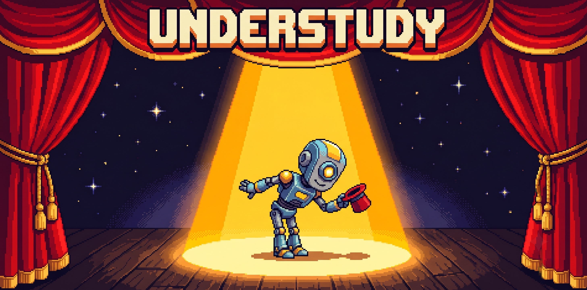
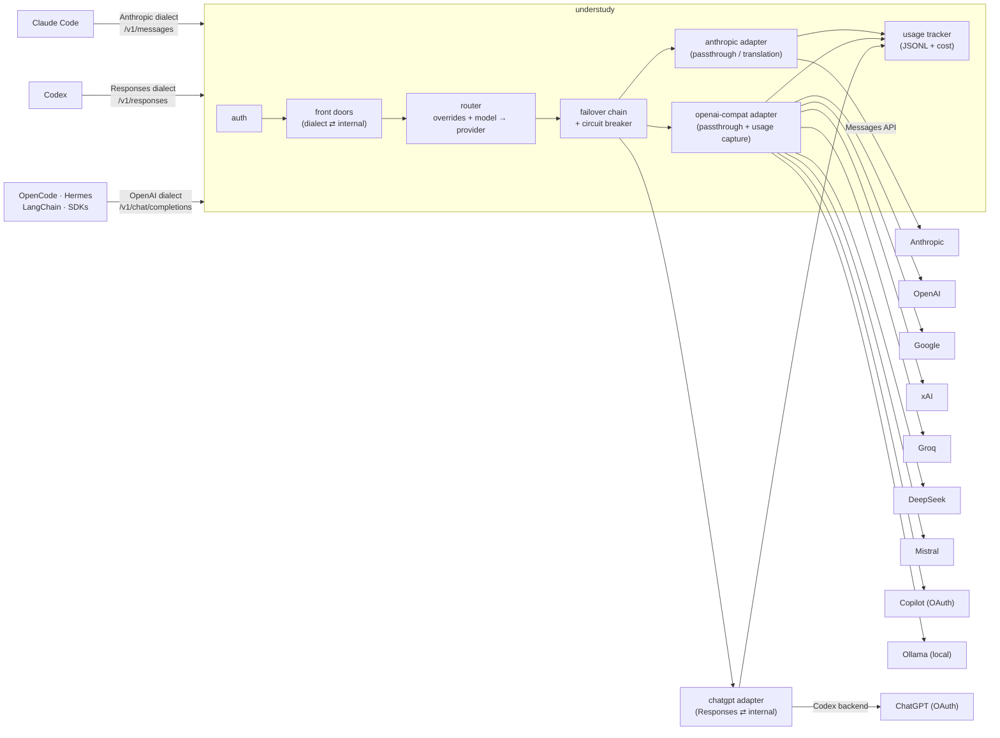

<p align="center">
  
</p>

<p align="center"><b>When your model can't go on, the show does.</b></p>

<p align="center">
  The self-hosted LLM gateway that keeps your AI agents running.<br/>
  Rate limit? Quota? Outage? The understudy steps in mid-performance - your agent never knows.
</p>

<p align="center">
  
  
  <a href="https://github.com/ariangibson/understudy/actions/workflows/ci.yml"></a>
  <a href="https://github.com/ariangibson/understudy/pkgs/container/understudy"></a>
  
  
</p>

---

## The scene

It's 2 a.m. Your agent is deep in an overnight run - the refactor is *finally* going somewhere. Then:

```
RateLimitError: 429 - you have exceeded your quota
```

The harness dies. The run dies. Your flow dies with it. You know this pain. Everyone running agents knows this pain.

**Understudy is the fix.** Point your agent at one endpoint. When the lead model can't perform, the gateway swaps in the next one mid-run, benches the one that failed, and brings it back when it recovers. No harness restart. No config change. No 2 a.m. page.

Install:

```bash
curl -fsSL https://understudy.cc/install.sh | bash
```

```bash
understudy
```

That's the whole thing. The first run walks you through a short setup - provider keys, a suggested fallback chain, and auto-wiring whichever harnesses it finds installed (Claude Code, Codex, OpenCode, Hermes, OpenClaw), backing up any file it touches - then raises the curtain. Every run after that just starts the gateway. Re-run the wizard any time with `understudy setup`, and un-wire everything in one command with `understudy disable` (see [Going dark](#going-dark)).

Requires Node 20+ (macOS / Linux). On Windows, `npx github:ariangibson/understudy` does the same today; a native installer is on the roadmap. Container and from-source options are in [Opening night](#opening-night).

Next time Claude hits a rate limit mid-session, the gateway politely benches the Anthropic API, and **gpt-5.5 steps into costume** - same session, same tools, the reply streamed back in Claude's own dialect. Your run keeps editing files and executing commands on the fallback model, and the lead retakes the stage the moment the bench expires.

```
Without understudy:                         With understudy:

  2 a.m. - Claude Code, mid-refactor          2 a.m. - Claude Code, mid-refactor
  claude-opus-4-8 → 429 rate limit            claude-opus-4-8 → 429 rate limit
  ✖ "limit resets at 6 a.m."                  ↳ claude benched · gpt-5.5 takes the stage
  ✖ session stalls, context goes cold         ↳ same session, same tools, no restart
  ✖ the curtain falls                         ✔ the show goes on
```

Your Claude login passes through untouched while Claude performs; the understudy bills its own account - an API key, or **the ChatGPT / Copilot / Claude subscription you already pay for**, seated via [season tickets](#season-tickets). Nobody reconfigures anything at 2 a.m.

Works out of the box with **Claude Code**, **Codex**, **OpenCode**, **Hermes Agent**, **OpenClaw**, **LangChain**, and anything else that speaks any of the three major wire dialects - all five named harnesses verified live against this gateway, tool calls and all, by the automated chaos drills in [`rehearsal/`](rehearsal/).

## Opening night

Installed above? You're done - this section is the other ways onto the stage.

```bash
npx github:ariangibson/understudy   # zero-install run (works on Windows too; first run sets up)

docker run --rm -p 42986:42986 --env-file .env ghcr.io/ariangibson/understudy:latest   # prebuilt, multi-arch
```

Or from source: `git clone https://github.com/ariangibson/understudy && cd understudy && npm install && npm run setup && npm run dev`.

Under it all, the two lines in `.env` that change everything (the wizard writes them for you):

```bash
ANTHROPIC_API_KEY=sk-ant-...
FALLBACK_CHAIN=anthropic/claude-sonnet-4-6,openai/gpt-5.5
```

That's it. Every request through the gateway - from any client, with **zero client-side changes** - now fails over down that chain whenever its model is unavailable.

```bash
curl http://localhost:42986/v1/chat/completions \
  -H "content-type: application/json" \
  -d '{"model": "claude-opus-4-8", "messages": [{"role": "user", "content": "Hello"}]}'
```

## Seat your agent

The gateway speaks all three wire dialects agent harnesses use - OpenAI chat completions, the Anthropic Messages API, and the OpenAI Responses API - so every major harness connects unmodified. `understudy setup` wires any of these automatically; the recipes below are for doing it by hand. Each was verified live: primary model down, fallback serving, tool calls included.

**Claude Code** - one environment variable; the harness speaks the Anthropic dialect to `/v1/messages`:

```bash
ANTHROPIC_BASE_URL=http://localhost:42986 claude
```

The whole failover story is literally two environment variables - one on each side:

```bash
FALLBACK_CHAIN=openai/gpt-5.5 understudy        # the understudy waits in the wings
```

```bash
ANTHROPIC_BASE_URL=http://localhost:42986 claude  # business as usual - until it isn't
```

When the route is Anthropic itself, requests pass through verbatim - prompt caching, thinking blocks, beta features, and even your Claude Pro/Max login all survive (the gateway forwards your session's OAuth token, so it bills exactly like talking to Anthropic directly). Only when an understudy steps in does translation happen.

**Codex** - speaks the OpenAI Responses dialect to `/v1/responses`. Since Codex 0.144, profiles live in their own file - create `~/.codex/understudy.config.toml` (a `[profiles.*]` table in the main `config.toml` is now a hard error):

```toml
model = "gpt-5.5"
model_provider = "understudy"

[model_providers.understudy]
name = "Understudy gateway"
base_url = "http://localhost:42986/v1"
env_key = "UNDERSTUDY_API_KEY"   # any env var holding your gateway key; omit if keys are unset
```

Then `codex --profile understudy` - your default Codex setup stays untouched.

This also frees Codex from Responses-only hosts: Codex [dropped chat-completions support](https://github.com/openai/codex/discussions/7782), but through the gateway it can run **any chat-completions-only provider** - `codex -m "syn:large:vision"` runs the current large open-weights model from [synthetic.new](https://synthetic.new) (verified live, tool calls included), no Responses support required on their end. Prefer synthetic's `syn:` aliases over pinned `hf:org/model` ids - they keep working when the host rotates in newer models.

**OpenCode** - custom provider in `opencode.json` ([docs](https://opencode.ai/docs/providers/)):

```json
{
  "provider": {
    "understudy": {
      "npm": "@ai-sdk/openai-compatible",
      "name": "Understudy",
      "options": { "baseURL": "http://localhost:42986/v1", "apiKey": "your-gateway-key" },
      "models": { "claude-sonnet-4-6": { "name": "Claude via Understudy" } }
    }
  },
  "model": "understudy/claude-sonnet-4-6"
}
```

One OpenAI-specific note: if the model routes to OpenAI's platform (`gpt-5.5` etc.), add `"options": { "reasoningEffort": "none" }` to the model entry - OpenAI rejects `reasoning_effort` combined with function tools on `/v1/chat/completions` for those models.

**Hermes Agent** - set a custom endpoint in the `model:` section of its config ([docs](https://hermes-agent.nousresearch.com/docs/integrations/providers)):

```yaml
model:
  default: claude-sonnet-4-6
  provider: custom
  base_url: http://localhost:42986/v1
  api_key: your-gateway-key
```

Gotcha: if you use Hermes' `openai-api` provider instead of `custom`, an `OPENAI_BASE_URL` line in `~/.hermes/.env` silently overrides `model.base_url` - set the gateway URL there, or requests keep going to the old endpoint no matter what the YAML says.

**OpenClaw** - point a provider's `baseUrl` at the gateway ([docs](https://docs.openclaw.ai/concepts/model-providers)). OpenClaw drives its `openai` provider over the Responses dialect, so it routes through `/v1/responses`:

```bash
openclaw config set models.providers.openai.baseUrl http://localhost:42986/v1
openclaw config set models.providers.openai.apiKey  your-gateway-key
openclaw config set agents.defaults.model.primary   openai/gpt-5.5
```

Gotcha: fresh sessions run a first-turn onboarding that will answer *instead of* your task - set `openclaw config set agents.defaults.skipBootstrap true` for unattended/headless runs.

**LangChain / LlamaIndex / your own code** - standard OpenAI client, custom base URL:

```python
from openai import OpenAI

client = OpenAI(base_url="http://localhost:42986/v1", api_key="your-gateway-key")

response = client.chat.completions.create(
    model="claude-sonnet-4-6",       # Claude as the agent brain, via the OpenAI SDK
    messages=[{"role": "user", "content": "Plan the next refactor step."}],
    tools=[...],                      # tool calling works across providers
)
```

Recast the lead by changing one string: `gpt-5.5`, `gemini-3.5-flash`, `grok-4.3`, `ollama/qwen3`, ...

## Going dark

Routing every agent through one local gateway is a single point of failure - if the gateway dies, your agents die with it. So the off switch is one command, and it works even when the gateway doesn't:

```bash
understudy disable
```

Every harness goes back to its direct connection: Codex gets its previous default provider back, Hermes its previous endpoint, Claude Code its own login. Whatever a harness was using before is recorded at enable time and restored exactly.

```bash
understudy enable
```

Re-routes everything through the gateway (with a loud warning first if no gateway is answering). Both commands also take a single harness: `understudy disable claude`, `understudy enable codex`, and so on.

```bash
understudy status
```

Who's on stage right now: gateway health, live providers, who's benched, and which harnesses are routed through the gateway versus talking to their providers directly.

## The cast

Three front doors, one stage. Whatever dialect your harness speaks on the way in - chat completions, Anthropic Messages, or OpenAI Responses - the router reads the model name (`claude-*` → Anthropic, `gpt-*` → OpenAI, `gemini-*` → Google, ...) or takes explicit `provider/model` form, and any model can answer in the dialect the client expects.

| Provider | Models | How |
|---|---|---|
| Anthropic | Claude (Fable, Opus, Sonnet, Haiku) | Full protocol translation, incl. live SSE re-emission and tool calling |
| OpenAI | GPT-5.x family | Passthrough |
| Google | Gemini 3.x | Passthrough (OpenAI-compatible endpoint) |
| xAI | Grok 4.x | Passthrough |
| Groq | Llama 4, etc. (fast inference) | Passthrough |
| DeepSeek | deepseek-chat / reasoner | Passthrough |
| Mistral | Mistral / Codestral | Passthrough |
| Ollama | Anything local - qwen3, llama, ... | Passthrough; keyless |
| Synthetic | Open weights - Kimi, GLM, Qwen, ... (`syn:` aliases, or pinned `hf:org/model`) | Passthrough |
| ChatGPT | GPT-5.x via Plus/Pro subscription | Responses-dialect adapter; OAuth ([season tickets](#season-tickets)) |
| Copilot | Models on your GitHub Copilot plan | Passthrough; OAuth ([season tickets](#season-tickets)) |

The interesting work is translation: understudy carries request shapes, response shapes, **tool calling in both directions** (`tools`/`tool_calls` ⇄ `tool_use`/`tool_result`), vision blocks, and entire SSE event streams across dialects - re-emitted live, event by event, in whichever format the client is listening for. A Claude Code session can be served by GPT-5.5 speaking fluent Anthropic SSE; a Codex session can be rescued by Claude speaking the Responses event family. Tools included, none the wiser.

*One program note:* when a request crosses dialects, provider-only extras that the target format can't express (`cache_control` breakpoints, thinking-block replay) are dropped. Same-dialect requests don't pay this tax - an Anthropic-bound request on `/v1/messages` passes through **verbatim**, caching and thinking intact.

## Cue the understudy

Failover triggers on retryable failures - HTTP 429 (rate limit / quota), 5xx, 529 (overloaded), network errors. Non-retryable errors (your malformed request won't get better on another model) are returned as-is.

The circuit breaker is what makes it fast under fire: a failing model is **benched** for `COOLDOWN_S` (default 30s - or whatever `Retry-After` the provider sends), and while benched, every request routes straight to the next model with zero wasted attempts. Benches expire on their own; the lead returns when it's ready. If *every* model in a chain is benched, understudy tries anyway rather than failing instantly.

```bash
# Per-request chain (overrides FALLBACK_CHAIN)
curl http://localhost:42986/v1/chat/completions -H "content-type: application/json" \
  -d '{
    "model": "anthropic/claude-opus-4-8",
    "fallbacks": ["anthropic/claude-sonnet-4-6", "openai/gpt-5-mini"],
    "messages": [{"role": "user", "content": "Hello"}]
  }'
```

You always know who's on stage:

| Signal | Meaning |
|---|---|
| `x-understudy-provider` / `x-understudy-model` | Who actually served this request |
| `x-understudy-fallback: from openai/gpt-5.5` | An understudy performed; this names the lead who couldn't |
| `GET /health` → `"cooldowns": {"openai/gpt-5.5": 47}` | Who's benched, and for how many more seconds |

Failover applies before first byte; a stream that dies midway isn't silently restarted - your harness's normal retry handles that, and the retry gets the failover.

### Recasting

Some harnesses only ask for fixed model names (Claude Code will only ever request `claude-*`). `MODEL_OVERRIDES` - set in your `.env` like everything else - rewrites the requested model before routing, so you can recast any role permanently:

```bash
# Send Claude Code's background/haiku traffic to a cheap fast model,
# while the main model stays on Anthropic with failover.
MODEL_OVERRIDES="claude-haiku-*=groq/llama-4-maverick"

# Or route ALL claude-* requests to DeepSeek (a trailing * matches by prefix)
MODEL_OVERRIDES="claude-*=deepseek/deepseek-chat"
```

The response still echoes the model the client asked for - the harness never knows the part was recast.

## Season tickets

API keys aren't the only way to pay for the show. The subscription you already pay for monthly can stand in as an understudy. One `login` command walks an OAuth flow and stores credentials in the gateway's home (`~/.understudy/data/auth.json`); any provider without an API key env then uses its stored subscription automatically - including as a link in the failover chain.

```bash
understudy login chatgpt      # ChatGPT Plus/Pro - your GPT-5.x tokens
```

```bash
understudy login anthropic    # Claude Pro/Max
```

```bash
understudy login copilot      # GitHub Copilot
```

(No install? `npx github:ariangibson/understudy login <provider>`. From a clone: `npm run login -- <provider>`.)

Claude Code, rescued by the ChatGPT subscription you're already paying for:

```bash
FALLBACK_CHAIN=chatgpt/gpt-5.5 understudy
```

```bash
ANTHROPIC_BASE_URL=http://localhost:42986 claude
```

Hit your Claude limit mid-session and **GPT-5.5 finishes the job on your ChatGPT plan** - no per-token API bill, the subscription you already own. (Verified live: Claude Code 429 → `chatgpt/gpt-5.5` served the next turns, tool calls and all.) The ChatGPT route talks to the same backend the Codex CLI uses, which is what accepts subscription tokens; the platform API (`api.openai.com`, billed per token) is a separate `openai/...` provider.

One program note: Anthropic bills *its* third-party OAuth usage per-token against your subscription's "extra usage" (not your plan limits) and has changed the rules in this area before - treat subscription auth as best-effort and keep an API key as the durable path. Native Claude Code users don't need any of this for Claude itself: its own login already passes through `/v1/messages` untouched.

## Rehearsals are free

Identical requests within the TTL (default 5 minutes) are served straight from memory - no provider call, no tokens billed, ~0 ms. Agent retries after crashes, eval-suite reruns, and tight dev loops stop re-billing you for lines the model already delivered.

The cache is stream-aware in both directions: a completed *streamed* response is reassembled from its own SSE chunks to populate the cache, and a cache hit for a `stream: true` request is replayed as synthesized SSE - clients can't tell the difference. The key ignores `stream` and `fallbacks`, so streamed and non-streamed requests for the same prompt share one entry.

- Responses carry `x-understudy-cache: hit | miss`
- Per-request opt-out: send `x-understudy-cache: bypass`
- Disable globally: `CACHE_TTL_S=0`

## The box office

Every request is logged (JSONL) with tokens, computed USD cost, latency, and who served it. You finally know what the overnight run cost - and what the cache saved you.

```bash
curl http://localhost:42986/v1/usage | jq
```

```json
{
  "total_requests": 42,
  "total_prompt_tokens": 18203,
  "total_completion_tokens": 9417,
  "total_cost_usd": 0.1962,
  "cached_requests": 9,
  "cache_saved_usd": 0.0411,
  "by_model": {
    "anthropic/claude-sonnet-4-6": { "requests": 30, "prompt_tokens": 15000, "completion_tokens": 8000, "cost_usd": 0.165 },
    "openai/gpt-5-mini": { "requests": 12, "prompt_tokens": 3203, "completion_tokens": 1417, "cost_usd": 0.0013 }
  }
}
```

Supports `?since=2026-06-01T00:00:00Z`. Anthropic prices are verified; other providers' rates change often - edit `src/pricing.ts` to match your account. Unknown models record `cost: null`, never a fabricated number.

## Playbill

| Endpoint | Description |
|---|---|
| `POST /v1/chat/completions` | OpenAI chat dialect (OpenCode, Hermes, LangChain, SDKs) - streaming, tools, vision, failover |
| `POST /v1/messages` | Anthropic Messages dialect (Claude Code) - verbatim passthrough to Anthropic, translated failover elsewhere |
| `POST /v1/messages/count_tokens` | Token counting passthrough (local estimate when no upstream is available) |
| `POST /v1/responses` | OpenAI Responses dialect (Codex, OpenClaw) - translated through the same chain |
| `GET /v1/models` | Live aggregated model list across all configured providers (5-min cache) |
| `GET /v1/usage` | Usage, cost, and cache-savings summary |
| `GET /health` | Status, active providers, current cooldowns (unauthenticated) |

Extras understood on chat requests: `fallbacks` (per-request failover chain) and `reasoning_effort` (mapped to Anthropic adaptive thinking + `output_config.effort`; passed through to providers that support it natively). Sampling params are auto-stripped for models that reject them (Opus 4.7+, Fable 5). Your provider keys live server-side; agents authenticate with gateway keys (`GATEWAY_API_KEYS`).

## Backstage



The design exploits an industry reality: **almost every provider already exposes an OpenAI-compatible endpoint**. Those all share one thin passthrough adapter that differs only in base URL and key - it forwards bytes and scans the SSE stream for the usage chunk without buffering. The two surfaces that don't (Anthropic's Messages API and the ChatGPT Codex backend) get real translation layers, written as pure functions with no I/O so the whole thing is unit-tested without mocks.

```
src/
  app.ts                       HTTP surface: auth, cache, three front doors
  chain.ts                     the failover loop, shared by every front door
  router.ts                    model overrides + model string → provider resolution
  cooldown.ts                  circuit breaker (bench / recover / report)
  config.ts                    provider registry (add a provider in ~8 lines)
  cache.ts                     response cache: keying, LRU+TTL, SSE assembly/replay
  sse.ts                       SSE parsing/encoding for cross-dialect streaming
  cli.ts                       the understudy command (serve / setup / login)
  setup.ts                     interactive wizard: keys, chain, harness wiring
  harnesses.ts                 enable/disable/status - route harnesses, restore them
  oauth.ts                     subscription credentials (login storage + refresh)
  login.ts                     OAuth login flows
  pricing.ts                   per-MTok price table → request cost
  usage.ts                     JSONL log + aggregation
  providers/
    anthropic-translate.ts     pure OpenAI ⇄ Anthropic translation (incl. streaming)
    anthropic.ts               SDK wiring for the translator
    anthropic-passthrough.ts   verbatim Messages forwarding (caching/betas intact)
    messages-translate.ts      pure inbound-Anthropic ⇄ internal translation
    responses-translate.ts     pure Responses ⇄ internal translation (both ways)
    chatgpt.ts                 ChatGPT Codex backend (subscription OAuth)
    openai-compat.ts           passthrough for every OpenAI-compatible provider
```

### Director's notes (design decisions)

- **The harness must never need to know.** Failover, cooldowns, and caching are server-side defaults, not client features - because agent frameworks send plain OpenAI requests and can't be taught gateway extensions. Anything requiring a client change is opt-in sugar, never load-bearing.
- **One internal dialect.** Every front door translates to chat completions at the edge, and every adapter translates from it. N client dialects x M providers stays N + M, not N x M.
- **Pure translation functions.** Plain objects and async iterables in, plain objects out. Tests feed fake event streams; no network, no SDK mocks.
- **Stream without buffering.** First tokens reach the agent immediately; usage capture and cache assembly tee SSE bytes through line scanners, never collect the response.
- **Fail honestly.** Unknown model → 400 with the exact fix. Missing key → 503 naming the env var. Unknown pricing → `cost: null`. Non-retryable errors are returned, not retried into a different model's mouth.
- **No database.** Usage is append-only JSONL aggregated on read; cooldowns and cache are in-memory. For a personal/team gateway: simpler, greppable, plenty fast.

## Stage directions

All via environment. The installed `understudy` command reads `.env` from its home, `~/.understudy/.env` (which `understudy setup` writes); a clone reads `./.env` (see `.env.example`):

| Variable | Purpose |
|---|---|
| `FALLBACK_CHAIN` | Server-wide failover chain (comma-separated models), applied to every request without its own `fallbacks` |
| `COOLDOWN_S` | Circuit-breaker bench time in seconds (default 30; provider `Retry-After` wins) |
| `GATEWAY_API_KEYS` | Comma-separated client keys. Empty = open (localhost only!) |
| `MODEL_OVERRIDES` | Recast map applied before routing: `pattern=target` pairs, trailing `*` matches by prefix |
| `ANTHROPIC_API_KEY`, `OPENAI_API_KEY`, `GOOGLE_API_KEY`, `XAI_API_KEY`, `GROQ_API_KEY`, `DEEPSEEK_API_KEY`, `MISTRAL_API_KEY`, `SYNTHETIC_API_KEY` | Enable each provider |
| `OLLAMA_ENABLED` / `OLLAMA_BASE_URL` | Local models via Ollama |
| `UNDERSTUDY_AUTH` | OAuth credentials file path (default `data/auth.json`; written by `understudy login`) |
| `CACHE_TTL_S` / `CACHE_MAX_ENTRIES` | Response cache TTL in seconds (default 300; 0 disables) and capacity (default 500) |
| `DEFAULT_MAX_TOKENS` | Used when clients omit `max_tokens` (default 4096) |
| `USAGE_LOG` | JSONL path (default `data/usage.jsonl`) |
| `UNDERSTUDY_ANTHROPIC_UPSTREAM` | Alternate Anthropic-compatible upstream for `/v1/messages` passthrough (testing, Bedrock-style proxies) |
| `UNDERSTUDY_OPENAI_UPSTREAM` | Alternate OpenAI-compatible upstream for the `openai` provider (testing, corporate proxies). Include the `/v1`; the Anthropic hook takes a bare host |
| `PORT` | Default 42986 |

Adding another OpenAI-compatible provider is one entry in `src/config.ts`.

## Tech rehearsal

```bash
npm run dev         # watch mode
npm run setup       # the interactive wizard, from a clone
npm test            # vitest - translation, routing, failover, cooldowns, cache
npm run typecheck   # strict TS, noUncheckedIndexedAccess
npm run build       # emit dist/
```

CI runs typecheck + tests on every push and PR; merges to `main` build and publish the multi-arch image to [`ghcr.io/ariangibson/understudy`](https://github.com/ariangibson/understudy/pkgs/container/understudy) (tags: `latest`, `sha-*`, and semver on `v*` tags).

## The dress rehearsal

Don't take the playbill's word for it - [`rehearsal/`](rehearsal/) is a live chaos drill
that points **real agent binaries** (Claude Code, Codex, OpenCode, Hermes Agent, OpenClaw) at the
gateway, injects a wire-accurate 429 from the primary provider mid-conversation, and
asserts three things from the traffic itself: the fallback finished the tool loop, the
primary got the traffic back after its cooldown, and the agent saw zero errors.

```bash
rehearsal/run.sh              # chaos proxies + gateway + tracing viewer
rehearsal/scenario.sh claude  # or codex | opencode | hermes
```

It comes with its own observability: every request through the drill is captured as a
span - tool calls, latency, TTFB, tokens, cost, and which provider actually served it -
with a live viewer at `http://127.0.0.1:42900/__ui`. See [rehearsal/README.md](rehearsal/README.md).

## License

MIT - *the show is yours.*
